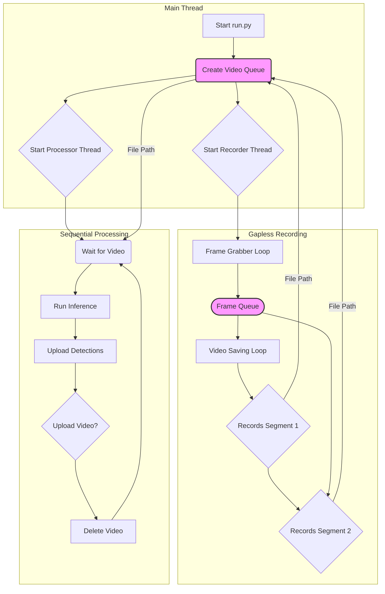

# Two-Stage Hailo Inference Pipeline

A two-stage machine learning pipeline that combines continuous video recording with asynchronous processing for invertebrate species identification. The system uses Hailo hardware acceleration for efficient edge computing.

## Project Structure

```
twostage-hailo-inference/
├── run.py                    # Main entry point for the continuous pipeline
├── main/                     # Core pipeline components
│   ├── __init__.py
│   ├── record_video.py       # Gapless video recording component
│   └── inference_from_video.py # Video processing and inference component
├── models/                   # ML-related modules
│   ├── __init__.py
│   ├── classification.py     # Classification inference
│   ├── detection.py          # Object detection inference
│   └── object_detection_utils.py  # Detection utilities
├── core/                     # Core utilities
│   ├── __init__.py
│   └── utils.py             # Hailo inference utilities
├── data/                     # Data files
│   ├── __init__.py
│   ├── labels.txt           # Object detection labels
│   └── london_invertebrates.txt  # Species classification labels
├── weights/                  # Model files (*.hef)
│   ├── small-generic.hef    # Detection model
│   └── london_141-multitask.hef  # Classification model
└── .env                     # Environment variables (create this)
```

## Asynchronous Architecture

The system is designed with a multi-threaded, queue-based architecture to ensure robust, continuous operation.

- **Recorder Thread**: A dedicated thread that runs the `VideoRecorder`. Its only job is to perform continuous, "gapless" video recording. It saves video segments to disk and places the file path of a completed video into a `Video Queue`. An internal frame-grabbing thread ensures that frames are not missed while a video file is being saved.

- **Processor Thread**: This thread acts as a consumer, waiting for video file paths to appear in the `Video Queue`. For each video, it performs the entire processing workflow sequentially:
    1.  Runs the two-stage inference model (detection and classification).
    2.  Uploads all generated detection data.
    3.  Randomly decides whether to upload the source video file based on a configured percentage.
    4.  Deletes the local video file to conserve disk space.

- **Main Thread**: The main thread initializes the pipeline, starts the recorder and processor threads, and then waits, primarily to catch a `KeyboardInterrupt` (Ctrl+C) for a graceful shutdown.

This decoupled design ensures that the recording process is never blocked by the computationally intensive inference or slow network uploads.



## Available Commands

### Running the Pipeline

```bash
# Run with default settings (records 5-min segments, 10% video upload chance)
python3 run.py

# Run with a different video directory and recording duration
python3 run.py --video-dir /media/storage/videos --duration 600

# Disable all uploads for testing
python3 run.py --disable-uploads

# Customize FPS and resolution
python3 run.py --fps 20 --resolution 1280x720
```

### Command Line Options

```bash
# Show all available options
python3 run.py --help
```

**Available Arguments:**
- `--video-dir PATH`: Directory to save and monitor videos (default: `recordings`).
- `--duration SECONDS`: Duration of each video segment in seconds (default: 300).
- `--upload-percentage N`: Percentage of video *files* to upload (0-100) (default: 10).
- `--device-id "ID"`: Device identifier for uploads (default: "pipeline").
- `--fps N`: Recording frame rate (default: 15).
- `--resolution WxH`: Recording resolution in `WIDTHxHEIGHT` format (default: `640x640`).
- `--confidence N`: Confidence threshold for detections (default: 0.35).
- `--disable-uploads`: Disable all database uploads (detections and videos).

## Environment Setup

### 1. Create `.env` File

Create a `.env` file in the project root directory with the following parameters:

```bash
# API Configuration
API_BASE_URL=https://your-api-endpoint.com
SENSING_GARDEN_API_KEY=your_api_key_here

# AWS S3 Configuration (for image storage)
AWS_ACCESS_KEY_ID=your_aws_access_key
AWS_SECRET_ACCESS_KEY=your_aws_secret_key
AWS_REGION=us-east-1
```

### 2. Required Environment Variables

| Variable | Required | Description |
|----------|----------|-------------|
| `API_BASE_URL` | Yes | Base URL for the Sensing Garden API |
| `SENSING_GARDEN_API_KEY` | Yes | API key for authentication |
| `AWS_ACCESS_KEY_ID` | Yes | AWS access key for S3 storage |
| `AWS_SECRET_ACCESS_KEY` | Yes | AWS secret key for S3 storage |
| `AWS_REGION` | No | AWS region for S3 bucket (default: `us-east-1`) |

### 3. Device and Model Configuration

All primary configuration is now handled via command-line arguments in `run.py`. The `device-id` is set with the `--device-id` flag.

The model files and species lists are referenced by file path in the code. If you need to change them, you can edit the default paths in the `VideoInferenceProcessor` class inside `main/inference_from_video.py`.

### 4. Model Files

Ensure you have the required model files in the `weights/` directory.