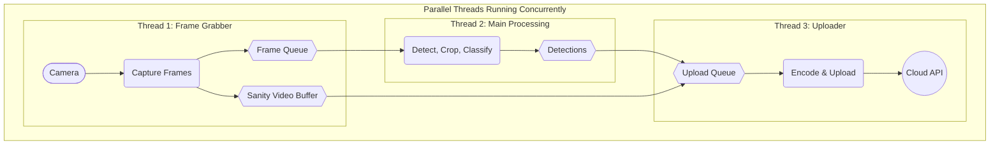

# Two-Stage Hailo Inference

A two-stage machine learning inference system that combines object detection and classification for invertebrate species identification. The system uses Hailo hardware acceleration for efficient edge computing.

## Project Structure

```
twostage-hailo-inference/
├── run.py                    # Main entry point (renamed from two-stage-edge.py)
├── models/                   # ML-related modules
│   ├── __init__.py
│   ├── classification.py     # Classification inference
│   ├── detection.py          # Object detection inference
│   └── object_detection_utils.py  # Detection utilities
├── core/                     # Core utilities
│   ├── __init__.py
│   └── utils.py             # Hailo inference utilities
├── data/                     # Data files
│   ├── __init__.py
│   ├── labels.txt           # Object detection labels
│   └── london_invertebrates.txt  # Species classification labels
├── weights/                  # Model files (*.hef)
│   ├── small-generic.hef    # Detection model
│   └── london_141-multitask.hef  # Classification model
└── .env                     # Environment variables (create this)
```

## Asynchronous Architecture

The system is designed with a multi-threaded architecture to ensure real-time performance by handling different tasks concurrently.

- **Frame Grabber Thread**: A dedicated thread's only job is to communicate with the camera. It continuously captures frames and places them into a `frame_queue`. If sanity video recording is active, it also copies these frames into a separate `video_buffer`. This ensures that the main application always has the latest frame available without waiting for the camera hardware.

- **Main Processing Thread**: This is the central coordinator. It runs in the main thread and performs the following tasks:
    - Takes a frame from the `frame_queue`.
    - Runs the computationally-heavy object detection and classification models on the frame.
    - Once every `upload_interval`, it hands off the collected detection data and video frames to the uploader thread.

- **Uploader Thread**: Another dedicated thread handles all slow I/O operations. It waits for data to appear in the `uploader_queue`. When the main thread provides a batch of data, this uploader thread:
    - Encodes the buffered frames into a .mp4 video file.
    - Uploads the detection data and the newly created video file over the network.

This asynchronous, multi-threaded design is crucial. It prevents the high-latency tasks of video encoding and network uploads from blocking the main processing loop, allowing the system to keep up with the camera's frame rate without dropping frames.



## Available Commands

### Real-time Inference (Camera Mode)

```bash
# Real-time inference WITHOUT database uploads (recommended for performance)
python3 run.py

# Real-time inference WITH database uploads
python3 run.py --enable-uploads

# Run in headless mode (no display window)
python3 run.py --headless

# Custom device ID for uploads
python3 run.py --enable-uploads --device-id "my_device_001"

# Enable sanity video recording (10% of upload interval)
python3 run.py --enable-uploads --sanity-video-percent 10
```

**What it does:**
- Captures live video from PiCamera2
- Performs real-time object detection and species classification
- Shows bounding boxes and classification results on screen
- Press 'q' to quit

**Upload behavior:**
- **Default**: Database uploads are **DISABLED** for better performance
- **With `--enable-uploads`**: Database uploads are **ENABLED** but may cause frame drops due to network delays

### Command Line Options

```bash
# Show all available options
python3 run.py --help
```

**Available Arguments:**
- `--enable-uploads`: Enable database uploads (disabled by default for performance)
- `--headless`: Run without display window (useful for remote deployment)
- `--upload-interval N`: Set upload interval in seconds (default: 60)
- `--sanity-video-percent N`: Record sanity videos for N% of upload interval (default: 0, disabled)
- `--device-id "ID"`: Set custom device identifier for uploads (default: "test_pipeline2")

### Help

```bash
# Show available commands and options
python3 run.py --help
```

## Environment Setup

### 1. Create `.env` File

Create a `.env` file in the project root directory with the following parameters:

```bash
# API Configuration
API_BASE_URL=https://your-api-endpoint.com
SENSING_GARDEN_API_KEY=your_api_key_here

# AWS S3 Configuration (for image storage)
AWS_ACCESS_KEY_ID=your_aws_access_key
AWS_SECRET_ACCESS_KEY=your_aws_secret_key
AWS_REGION=us-east-1

# Optional: Override default region
# AWS_REGION=eu-west-1
```

### 2. Required Environment Variables

| Variable | Required | Description | Default |
|----------|----------|-------------|---------|
| `API_BASE_URL` | Yes | Base URL for the Sensing Garden API | None |
| `SENSING_GARDEN_API_KEY` | Yes | API key for authentication | None |
| `AWS_ACCESS_KEY_ID` | Yes | AWS access key for S3 storage | None |
| `AWS_SECRET_ACCESS_KEY` | Yes | AWS secret key for S3 storage | None |
| `AWS_REGION` | No | AWS region for S3 bucket | `us-east-1` |

### 3. Device and Model Configuration

**Device ID**: Use the `--device-id` command line argument to set your device identifier:

```bash
python3 run.py --enable-uploads --device-id "my_edge_device_001"
```

**Model ID**: The system uses a hardcoded model identifier. To customize it, edit this line in `run.py`:

```python
# In the InferenceProcessor.__init__ method (around line 39)
self.model_id = "london_141"         # Change this to your model identifier
```

These values are used to tag your detections in the database for organization and tracking purposes.

### 4. Model Files

Ensure you have the required model files in the `